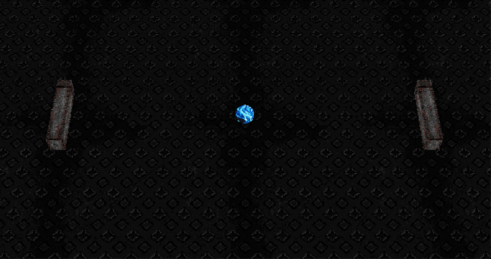

# sake



a PSX-styled Pong-like demo game built with [r3f](https://github.com/pmndrs/react-three-fiber) and drei. two paddles, one blue ball, lots of dark dithered floor.

## playing

- press space to serve
- W/S moves the left paddle, up/down arrows move the right one
- there's no score — when the ball gets past you, it just quietly resets and you live with what you did
- sound on: the ball pings at a slightly random pitch every bounce

## the PSX part

- renders at 0.1–0.3 dpr and upscales with nearest-neighbor, so the pixels are big and honest
- a custom shader material snaps vertices to a coarse grid, which gives everything that wobbly PS1 jitter
- textures are 256×256 jpgs — at this resolution anything bigger would be pure vanity
- angled "floating" camera, like watching the table from a chair someone pushed slightly back

## running it

```
npm install
npm run dev
```

that's it. vite serves it, space starts it.
